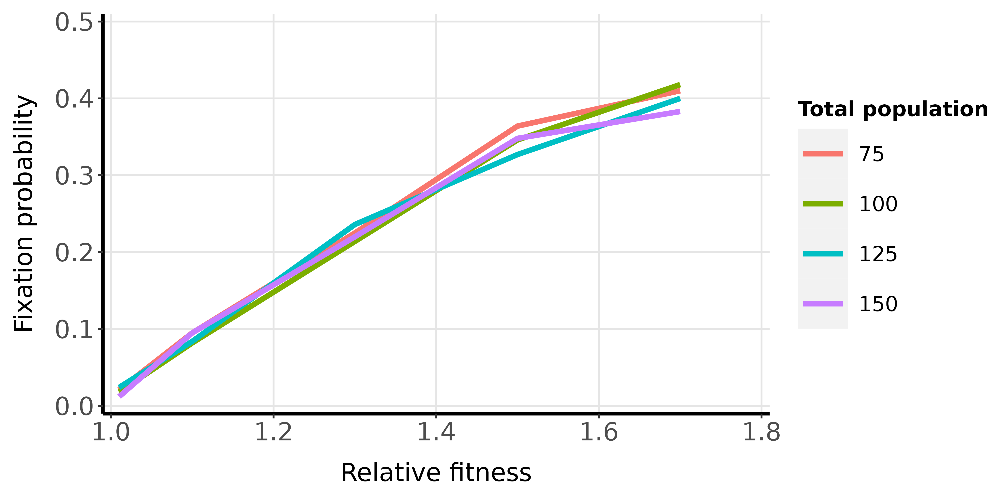

```{r setup, include=FALSE}
knitr::opts_chunk$set(echo = TRUE)
```

# Introduction 

The Moran's process is a simple stochastic model to conceptualize how mutant populations can be fixed in a population. The model was conceptualized by the statistician Patrick @moran_1958.

The model assume that the total population size is constant, with fluctuations only for the number of mutant and non-mutant populations. The population is assumed as well-mixed. The initial population sizes of mutants and non-mutants can be changed. It is possible to design models in which the relative fitness increase the probability of reproduction, or decrease the probability of death. The utilized model in this repository follows the first option, as described by Martin @Nowak_06.


Each iteration substitute concomitantly a random cell (the "eliminated") by another copy of a random cell (the "reproduced") . For each iteration, three options are possible:

- Increment of mutant population size: the probability of increment (**P(increment)**) is the multiplication between the probability of a mutant being selected as "reproduced" and a non-mutant being selected as "eliminated".

**P(increment) = ((r\*N) / (r\*N + N - m)) * ((N - m)/(N))**

- Decrement of mutant population size: the probability of decrement (**P(decrement)**) is the multiplication between the probability of a non-mutant being selected as "reproduced" () and a mutant being selected as "eliminated".

**P(decrement) = ((N -  m) / (r\*m + N - m)) \* ((m)/(N))**

- Same mutant population size: the probability of maintaining the same mutant population size (**P(staying)**) is the sum of the probabilities of two events, which are the cases when the "reproduced cell" and the "eliminated cell" are from the same type. This probability can be calculated as 

**P(staying) = 1-[P(increment)-P(decrement)]**

One of the consequences of the model is that the probability of fixation (i.e., the probability that a mutant population is the remaining one, starting with initial population size of 1) of the mutant population is **constant**, depending only on the values of the total population size and of the relative fitness (r = $r_(mutant)$/$r_(nonMutant)$) of the mutant:

**P(fixation) = (1-1/$r$)/(1-1/$r^N$)**

The project presented here execute the stochastic simulation of the Moran process, aiming to recover the predicted values for the fixation probabilities.

# Simulation

Since the fixation probability depends on the total population size and the relative fitness of the mutant, we tested combinations between four different values of population size (75, 100, 125 and 150) and 5 values of relative fitness (1.01, 1.1, 1.3, 1.5 and 1.7). For each of these combinations, 1,000 simulations were executed. The simulations are finished when the mutant population or the nonMutant population takes entire control.


# Results

Below, it is presented the graph of the obtained proportions from the simulations. It is possible to observe that, in accordance with the Equation 1, the probability of fixation of a mutant (for the attempted values in the simulation) grows in proportion with the relative fitness of the mutant population (when the relative fitness has value higher than 1).

```{r sad, fig.cap = "Figure 1. Probability of fixation obtained through the simulations, with the total population size and relative fitness as independent variables."}

```

## References

<div id="refs"></div>
